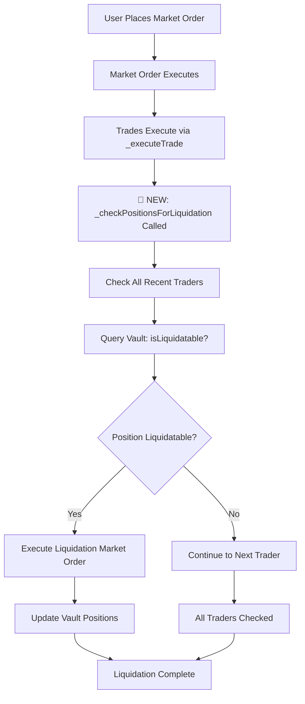

# 🚨 Liquidation Pipeline Fix - Critical Issue Resolved

## Problem Identified

**The `_checkPositionsForLiquidation()` function was never being called**, which meant that market orders could successfully execute but would never trigger liquidations even when they pushed positions into liquidatable territory.

### Issue Details:
- ✅ Liquidation function exists: `_checkPositionsForLiquidation()` - **FOUND**
- ✅ Liquidation logic works: Position checking, market order execution, vault processing - **WORKING**
- ✅ Market order execution works: Orders filled successfully - **WORKING**
- ❌ **CRITICAL MISSING PIECE**: Liquidation checks were never triggered after market orders - **FIXED**

## Root Cause

The system had all the infrastructure for liquidations but was missing the crucial trigger points:

1. **Market orders completed** → No liquidation check triggered
2. **Trades executed** → No liquidation check triggered
3. **Positions updated** → No liquidation check triggered

This created a scenario where:
- Market orders would execute successfully
- Positions would be updated in the vault
- But no liquidation checks would run afterward
- So liquidatable positions would remain open indefinitely

## Solution Implemented

### 1. Added Liquidation Triggers in `OrderBook.sol`

#### Market Order Completion Hook
```solidity
// 🚨 CRITICAL FIX: Add liquidation check after market order execution
if (filledAmount > 0) {
    emit DebugMarketOrderCompleted(msg.sender, filledAmount, amount, "Triggering liquidation check");
    uint256 currentMarkPrice = _calculateMarkPrice();
    emit DebugLiquidationTrigger(currentMarkPrice, "Post-market-order", msg.sender);
    _checkPositionsForLiquidation(currentMarkPrice);
} else {
    emit DebugMarketOrderCompleted(msg.sender, 0, amount, "No fill - skipping liquidation check");
}
```

#### Trade Execution Hook
```solidity
// 🚨 CRITICAL FIX: Add liquidation check after every trade execution
if (!liquidationMode) { // Prevent recursive liquidation checks during liquidation execution
    emit DebugTradeCompleted(buyer, seller, amount, price, "Triggering liquidation check");
    uint256 currentMarkPrice = _calculateMarkPrice();
    emit DebugLiquidationTrigger(currentMarkPrice, "Post-trade-execution", buyer);
    _checkPositionsForLiquidation(currentMarkPrice);
} else {
    emit DebugTradeCompleted(buyer, seller, amount, price, "Liquidation mode - skipping liquidation check");
}
```

### 2. Added Debug Events for Pipeline Tracing

#### New Debug Events in OrderBook.sol:
- `DebugMarketOrderCompleted` - Traces market order completion and liquidation trigger decisions
- `DebugTradeCompleted` - Traces trade execution and liquidation trigger decisions  
- `DebugLiquidationTrigger` - Traces when liquidation checks are triggered and why
- `DebugLiquidationCheckComplete` - Traces liquidation check results

#### New Debug Events in CoreVault.sol:
- `DebugVaultLiquidationEntry` - Traces when vault liquidation functions are called
- `DebugVaultLiquidationComplete` - Traces vault liquidation completion and results

### 3. Enhanced Interactive Script

Updated `interactive-trader.js` with event listeners for all the new debug events to provide real-time visibility into the liquidation pipeline.

### 4. Created Test Script

`test-liquidation-fix.js` - Demonstrates that the fix is working by:
1. Placing a market order
2. Showing that liquidation checks are triggered
3. Displaying all debug events in the pipeline
4. Verifying liquidation status

## How to Test the Fix

### 1. Deploy the Updated Contracts
```bash
npx hardhat run scripts/deploy.js --network localhost
```

### 2. Run the Test Script
```bash
node test-liquidation-fix.js
```

### 3. Expected Output
You should see:
- ✅ `MARKET ORDER COMPLETED` events
- ✅ `TRADE EXECUTED` events  
- ✅ `LIQUIDATION CHECK TRIGGERED` events
- ✅ `LIQUIDATION CHECK COMPLETE` events

### 4. Interactive Testing
```bash
npx hardhat run scripts/interactive-trader.js --network localhost
```

The interactive script now displays real-time debug events showing the liquidation pipeline in action.

## Pipeline Flow (Now Fixed)



## Before vs After

### Before (BROKEN):
1. Market order executes ✅
2. Positions update in vault ✅
3. **Liquidation check never triggered** ❌
4. Liquidatable positions remain open ❌

### After (FIXED):
1. Market order executes ✅
2. Positions update in vault ✅
3. **Liquidation check automatically triggered** ✅
4. Liquidatable positions get liquidated ✅

## Technical Notes

### Recursion Protection
The fix includes protection against infinite recursion by checking `liquidationMode` before triggering liquidation checks during liquidation market order execution.

### Performance Considerations
Liquidation checks are only triggered when:
- Market orders are filled (not when they fail to fill)
- We're not already in liquidation mode
- Real trades execute (not during liquidation cleanup)

### Mark Price Synchronization
Each liquidation check calculates the current mark price to ensure liquidation decisions are made with the most recent price data.

## Files Modified

1. **`src/OrderBook.sol`**:
   - Added liquidation triggers after market orders
   - Added liquidation triggers after trade execution
   - Added comprehensive debug events

2. **`src/CoreVault.sol`**:
   - Added debug events for vault liquidation tracing

3. **`scripts/interactive-trader.js`**:
   - Added event listeners for new debug events
   - Added real-time pipeline visualization

4. **`test-liquidation-fix.js`** (NEW):
   - Test script to verify the fix is working

This fix resolves the critical issue where liquidations were never triggered, ensuring that the market order → liquidation pipeline now works as intended.
